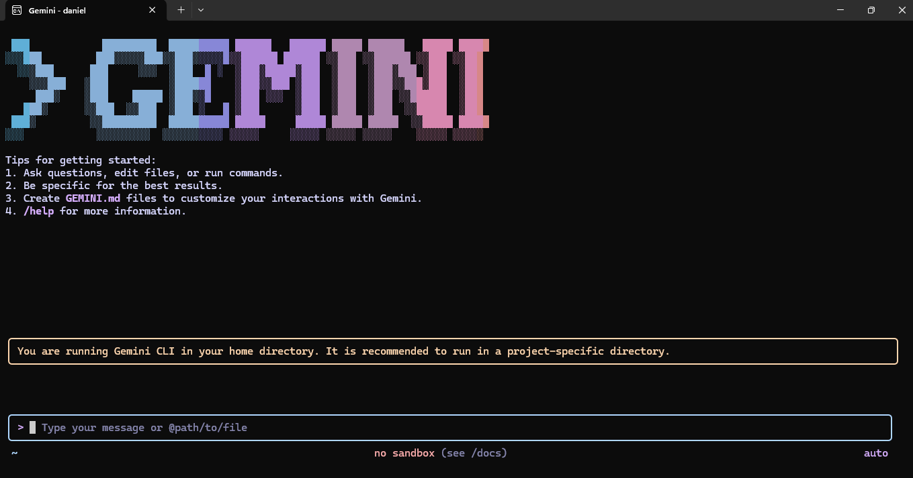
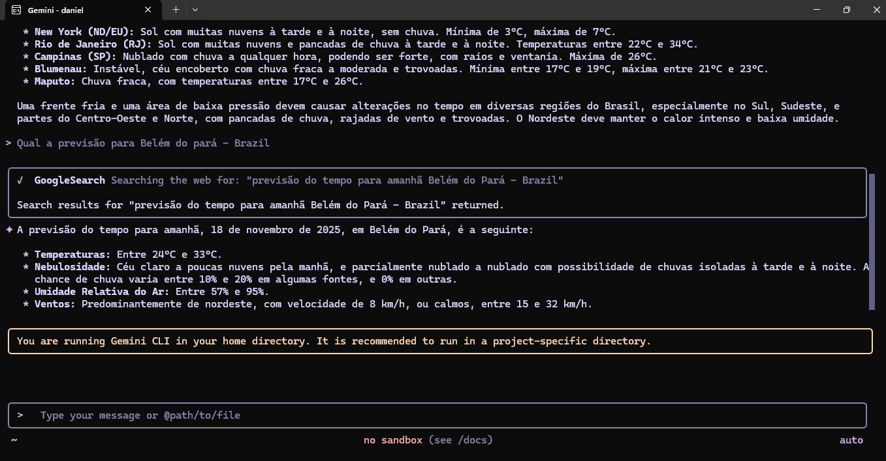
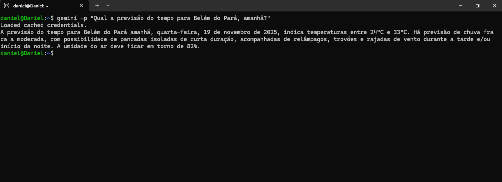

# instalacao-gemini-cli-linux
Guia completo para instalar o Gemini CLI no Ubuntu - IA do Google no terminal

# Gemini CLI no Ubuntu: Guia Completo de Instalação

A inteligência artificial está cada vez mais integrada ao fluxo de trabalho de desenvolvedores e profissionais de tecnologia. O Gemini CLI é a ferramenta de linha de comando do Google que permite interagir com o Gemini AI diretamente do terminal, sem necessidade de interface gráfica ou navegador.

Este guia apresenta o passo a passo completo para instalar o Gemini CLI no Ubuntu, desde a preparação do ambiente até a primeira interação com a IA.

---

## Pré-requisitos

- Ubuntu 20.04 ou superior (ou WSL2 com Ubuntu)
- Conta Google para autenticação
- Conexão com a internet

---

## Instalação

### Passo 1: Atualizar os pacotes do sistema

Antes de qualquer instalação, atualize a lista de pacotes disponíveis:
```bash
sudo apt update
```

---

### Passo 2: Instalar o curl

O curl é necessário para baixar o script de instalação do Node.js:
```bash
sudo apt install curl -y
```

---

### Passo 3: Adicionar o repositório do Node.js v20.x

O repositório padrão do Ubuntu possui uma versão antiga do Node.js. É necessário adicionar o repositório oficial com a versão 20.x:
```bash
curl -fsSL https://deb.nodesource.com/setup_20.x | sudo -E bash -
```

O Gemini CLI requer Node.js 18 ou superior para funcionar corretamente. A versão 20 é LTS (Long Term Support) e garante estabilidade e suporte prolongado.

---

### Passo 4: Instalar o Node.js e NPM

Agora o sistema instalará a versão correta do repositório adicionado:
```bash
sudo apt-get install -y nodejs
```

Para verificar se a instalação foi bem-sucedida:
```bash
node --version
npm --version
```

O resultado esperado é algo como v20.x.x para o Node.js.

---

### Passo 5: Instalar o Gemini CLI globalmente

Com o NPM instalado, instale o Gemini CLI:
```bash
sudo npm install -g @google/gemini-cli
```

A flag -g instala o pacote globalmente, permitindo usar o comando gemini de qualquer diretório no terminal.

---

### Passo 6: Autenticar com sua Conta Google

Para utilizar o Gemini, é necessário autenticar com uma conta Google:
```bash
gemini auth login
```

Este comando gera um link de autenticação. Abra o link no navegador, faça login com sua conta Google e autorize o acesso. Após a autorização, retorne ao terminal - a autenticação será confirmada automaticamente.

---

### Passo 7: Testar a instalação

Execute um teste para confirmar que tudo está funcionando:
```bash
gemini "Qual a previsão do tempo para amanhã?"
```

Se a instalação estiver correta, o Gemini responderá diretamente no terminal.

---

## Modos de Uso

O Gemini CLI oferece diferentes formas de interação conforme a necessidade.

### Modo interativo
```bash
gemini
```

Abre uma interface de chat contínuo onde é possível fazer múltiplas perguntas sem sair do ambiente. Ideal para sessões de consulta prolongadas.

### Modo direto
```bash
gemini -p "Sua pergunta aqui"
```

Retorna a resposta e volta ao prompt do terminal. Recomendado para consultas rápidas e integração com scripts de automação.

### Exemplos práticos
```bash
# Consulta de previsão do tempo
gemini -p "Qual a previsão do tempo para Belém do Pará, amanhã?"

# Auxílio com código
gemini -p "Como criar uma função em Python que calcula fatorial?"

# Explicações técnicas
gemini -p "Explique o conceito de containerização com Docker"
```

---

## Solução de Problemas

### Erro: node command not found

O Node.js não foi instalado corretamente. Execute novamente os passos 3 e 4.

### Erro: gemini command not found

O Gemini CLI não está no PATH do sistema. Reinstale com:
```bash
sudo npm install -g @google/gemini-cli
```

### Erro de autenticação

Execute novamente o processo de login:
```bash
gemini auth login
```

---

## Demonstração

As imagens abaixo mostram o Gemini CLI em funcionamento após a instalação completa.

### Interface inicial do Gemini CLI



### Exemplo de interação com busca na web



### Consulta direta via linha de comando



---

## Vantagens do Gemini CLI

**Produtividade** - Consultas à IA sem sair do ambiente de desenvolvimento.

**Automação** - Possibilidade de integração com scripts bash e pipelines.

**Performance** - Interface leve e respostas rápidas diretamente no terminal.

**Custo** - Utiliza a conta Google sem custos adicionais para uso básico.

---

## Recursos Adicionais

- Repositório oficial do Gemini CLI: https://github.com/google/gemini-cli
- Downloads do Node.js: https://nodejs.org/
- Google AI Studio: https://aistudio.google.com/

---

## Sobre este guia

Este material foi desenvolvido para compartilhar conhecimento com a comunidade de tecnologia. O objetivo é facilitar a adoção de ferramentas de IA no dia a dia de desenvolvedores, administradores de sistemas e profissionais DevOps.

Sugestões de melhoria e correções são bem-vindas através de issues ou pull requests.

---

## Autor

Daniel Melo - Especialista em Soluções com IA e Infraestrutura Cloud

---

## Licença

Este projeto está disponível sob a licença MIT.

---

#GeminiCLI #Google #InteligenciaArtificial #Linux #Ubuntu #DevOps #Terminal #Automacao
